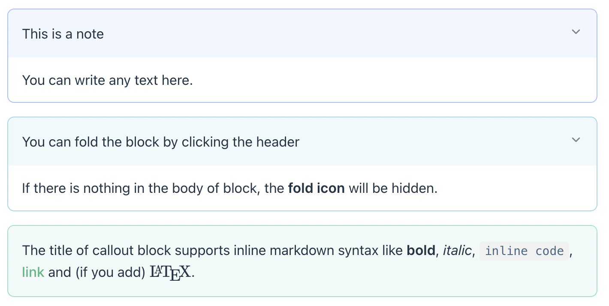

# vitepress-plugin-callout (WIP)

[](https://www.npmjs.com/package/vitepress-plugin-callout)

This is a plugin for vitepress that support callout blocks. The callout block is inspired by [Obsidian](https://obsidian.md).

## Some examples



## Installation

Install the plugin with npm.

```sh
npm install vitepress-plugin-callout
```

Then import it into vitepress

```ts
// .vitepress/config.ts
import callout from 'vitepress-plugin-callout'
export default {
  markdown: {
    config: (md: markdownit) => {
      md.use(callout)
    }
  }
}
```

Import styles (I have no idea how to build css files into dist, so try to download it from github and import mannually `¯\_(ツ)_/¯`)

```ts
// .vitepress/theme/index.ts
import 'path/to/styles.css'
```

## Usage

Basic usage.

```markdown
> [!note] This is a note
> This is the body of callout block.
>
> You can write more lines.
```

If you do not want the callout body, just write the title, and the fold icon will be hidden.

```markdown
> [!tip] Callout without body
```

All of the callout blocks are *expanded* by default, except the _example_ block. However, you can change it mannually.
If you want to fold the block by default, you can write `open` or `closed` in the options.

```markdown
> [!info|closed] The block will be folded by default.
> You can click the header to expand it.
```

The following callout types are supported.

|Type	|Aliases|
|-------|-------|
|note	|note, seealso|
|abstract	|abstract, summary, tldr|
|info	|info, todo|
|tip	|tip, hint, important|
|success	|success, check, done|
|question	|question, help, faq|
|warning	|warning, caution, attention|
|failure	|failure, fail, missing|
|danger	|danger, error|
|bug	|bug|
|example	|example|
|quote	|quote, cite|

## Repo template

[antfu/starter-ts](https://github.com/antfu/starter-ts.git)

## License

[MIT](./LICENSE) License © 2022 [widcardw](https://github.com/widcardw)
